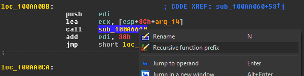
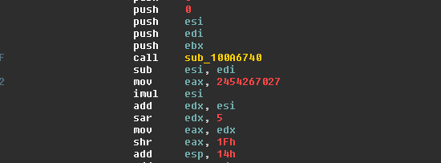
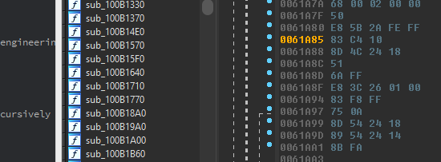
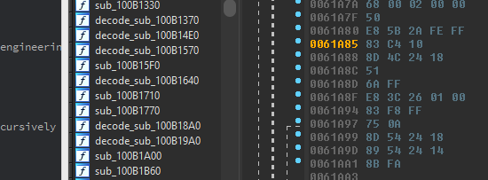

# Prefix - Function Prefixing for IDA Pro

## Overview

Prefix is a small function prefixing plugin for [IDA Pro](https://www.hex-rays.com/products/ida/). The plugin augments IDA's function renaming capabilities by adding a handful of convenient prefixing actions to relevant right click menus.

## Releases

* v1.1 -- Added IDA 7 support.
* v1.0 -- Initial release

## Installation

Install Prefix into the IDA plugins folder.

- Copy the contents of the `plugin` folder to the IDA plugins folder
    - On Windows, the folder is at `C:\Program Files (x86)\IDA 6.8\plugins`
    - On MacOS, the folder is at `/Applications/IDA\ Pro\ 6.8/idaq.app/Contents/MacOS/plugins`
    - On Linux, the folder may be at `/opt/IDA/plugins/`

The plugin is platform agnostic, but has only been tested on Windows for IDA 6.8 --> 7.0

## Usage

The Prefix plugin loads automatically when an IDB is opened. The plugin will populate right click menus in the Functions, Disassembly, and HexRays views with additional actions when appropriate.

## Recursive Prefix

A common technique to quickly triage and group related functions while reverse engineering is via a recursive prefix.

Right clicking a function in the disassembly view now provides an option to 'Recursively prefix' a function and all of its callee's.

## Bulk Prefix

Any number of functions can now be selected in the functions view and assigned a user specified prefix.

## Clear Prefix

User prefixes can easily be cleared via the 'Clear prefix' option added to the Functions window right click menu.

## Authors

* Andrew Marumoto
* Markus Gaasedelen ([@gaasedelen](https://twitter.com/gaasedelen))
